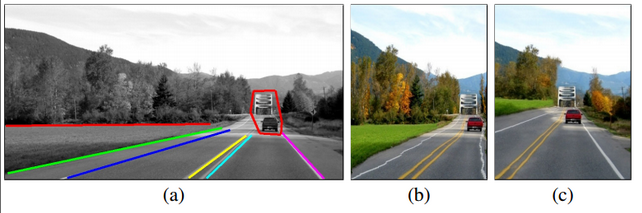

1. Interactive Content Aware resizing of images without the introduction of artefacts.
2. Using the patchmatching algorithm to implement resizing of features.
3. Existing algorithms like Seam Carving do not preserve structures well, and offers only limited control over the results.
4. [Source](http://www.wisdom.weizmann.ac.il/~vision/VisualSummary/bidirectional_similarity_CVPR2008.pdf)
5. Some retargeting results:
	- 
	- 
	- 
